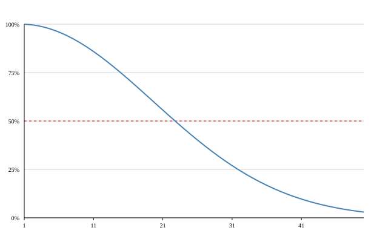

* Birthday Problem

** Given a group of N people, how large does N need to be for at least a 50% chance of at least 2 people sharing a birthday?

** Plot x=percentage, y=N

*** At N=23, we hit ~50%
